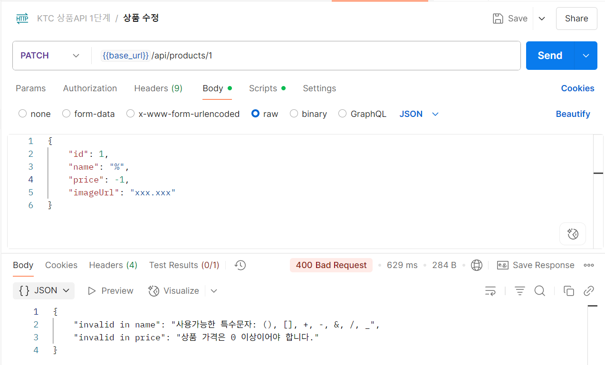
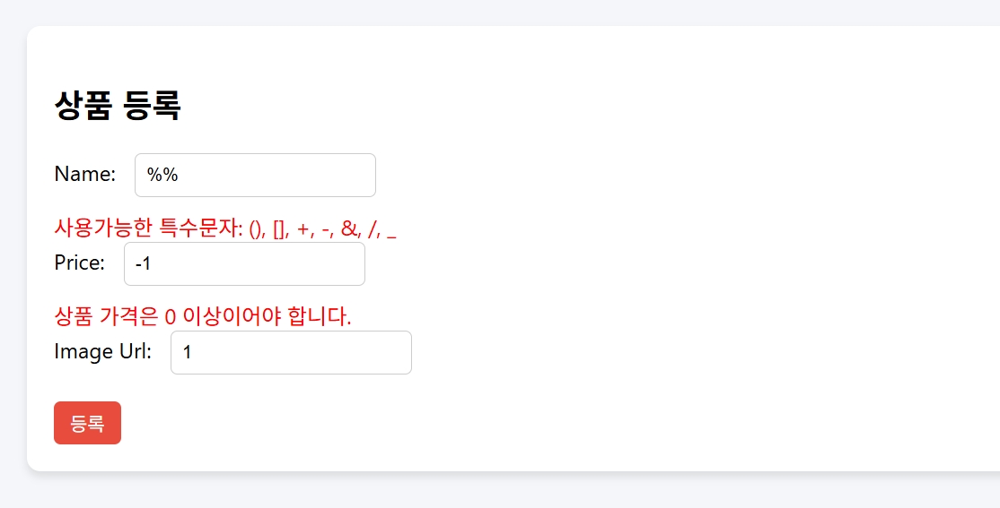

# spring-gift-wishlist

## 상품 위시 리스트 - step 1: 유효성 검증 및 예외처리
- 상품 등록/수정 과정에서 각 필드값에 대한 유효성 검증 로직을 추가함.

### 1. 상품 관리 API(일반 사용자용) 유효성 검증 및 예외처리
- 상품명: 허용된 특수문자만 사용 가능, '카카오'가 들어간 이름은 관리자와 협의 필요.
- 상품 가격: 0 이상이어야 함.
- 이미지 url: 길이가 500이하여야 함.

- 참고사항: '카카오' 이름 포함 여부는 service 단에서 검증한 후, 별도의 예외 INVALID_KAKAO_NAME을 발생시킴.
- 요구사항을 위배했을 시 400 error와 error 메세지가 전달됨.

### 2. 상품 관리 API(관리자용) 페이지 유효성 검증 및 예외처리
- 상품명: 허용된 특수문자만 사용 가능.
- 상품 가격: 0 이상이어야 함.
- 이미지 url: 길이가 500이하여야 함.

- 참고사항: 관리자는 '카카오' 이름이 포함된 상품명을 등록 및 수정할 수 있음.
- 각 필드의 제한사항을 위배했을 때에는 입력폼 아래에 붉은 글씨로 경고 메세지가 생성됨.

