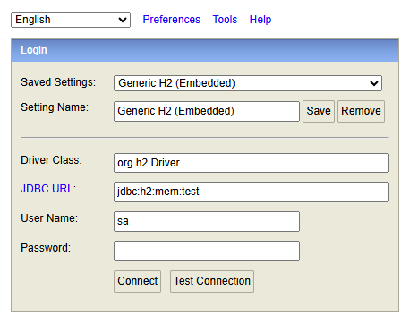

# 📝 소개

- - -
카카오테크 캠퍼스 백엔드 step2 과정으로 카카오톡의 선물하기 기능을 클론 코딩하는 것을 목적으로 한다.

# 📖 API 명세

- - -

## 상품 관리 API

| URL                       | 메서드    | 기능            | 설명           |
|---------------------------|--------|---------------|--------------|
| /api/products             | POST   | 상품 생성         | 새로운 상품 등록    |
| /api/products             | GET    | 상품 조회 (목록 조회) | 상품 목록 조회     |
| /api/products/{productId} | GET    | 상품 조회 (단건 조회) | 특정 상품의 정보 조회 |
| /api/products/{productId} | PUT    | 상품 수정         | 기존 상품 정보 수정  |
| /api/products/{productId} | DELETE | 상품 삭제         | 기존 상품 삭제     |

[자세한 API 문서 보러 가기](Api.md)

# 🛠️ 관리자 페이지

관리자는 웹 기반 UI를 통해 상품 정보를 관리하는 것이 가능하다.

- 접속 주소: http://localhost:8080/admin/products

---

## 주요 기능

- 상품 등록: 상품명, 가격, 이미지 URL 입력
- 상품 수정: 기존 상품 정보 수정
- 상품 삭제: 불필요한 상품 제거
- 상품 목록: 전체 상품 확인

---

# 🗄️️ 데이터베이스 연결

H2 In-Memory 데이터베이스를 사용하여 간단한 개발 및 테스트 환경을 구성한다.

## 접속 정보

- H2 콘솔 주소: http://localhost:8080/h2-console
- JDBC URL: jdbc:h2:mem:test
- Username: sa
- Password: (비워둠)

## 접속 방법

1. 서버를 실행한 후 브라우저에서 `http://localhost:8080/h2-console` 로 접속
2. JDBC URL 입력란에 `jdbc:h2:mem:test` 입력
3. 사용자명은 `sa`, 비밀번호는 공란으로 둔 채 Connect 클릭

## 콘솔 접속 화면 예시

