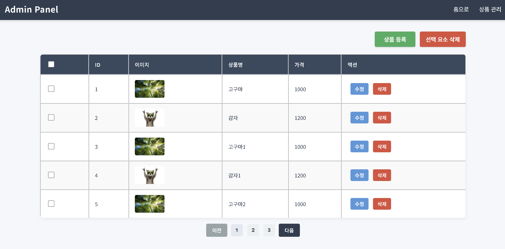

## step2 - Admin 페이지 (Thymeleaf 기반)

1. **구조 설계 및 구성**

- 🔹 템플릿 분리 (`Fragment`)

    - `Thymeleaf`의 `th:fragment` 기능을 이용해 반복되는 영역(header, footer)을 분리.
    - 관리자 기능이 추가되어도 `레이아웃 변경 없이 UI 조합만으로 확장` 가능.
    - 예시 구조:

  ```
  templates/
  ├── admin/
  │   └── product-manage.html
  └── fragments/
      ├── header.html
      └── footer.html
  ```

- 🔹 정적 자산 분리 (CSS / JS)

    - CSS, JS를 모두 `/static/` 경로에 분리하여 유지보수성 확보:

  ```
  static/
  ├── css/
  │   └── product-manage.css
  └── js/
      └── product-manage.js
  ```

    - 관리자 페이지 특화 스타일 `.admin-header`, `.admin-footer` 정의

    - `header`는 상단 고정, `footer`는 하단 고정 처리

2. **사용자 경험 개선 (UX)**

- 🔹 선택 삭제 기능

    - 상품 목록에서 체크박스를 통해 다중 선택 후, `선택 삭제` 버튼으로 삭제 가능
    - 실수 방지를 위해 `confirm 창`으로 사용자 확인을 받고 진행

- 🔹 페이징 처리

    - 화면 하단에 최대 5개의 페이지 버튼이 보이며, 현재 페이지를 강조 표시
    - `JS + 백엔드 페이징 API` 연동으로 동작

3. **트러블슈팅 & 최적화**

- 🛠 문제: 다수 삭제 시 I/O 과다

    - 기존: `DELETE /products/{id}` 방식으로 각 상품마다 삭제 요청
    - 결과: 클라이언트 → 서버로 **N번의 HTTP 요청** 발생
      → 네트워크 병목 및 서버 부하

- ✅ 해결: Bulk Delete API 도입

    - 개선: `DELETE /api/products/bulk` + `@RequestBody List<Long> ids` 사용
    - 서버 내부에서 `ConcurrentHashMap.remove()`를 순차적으로 수행
    - 결과: **1회의 HTTP 요청**으로 여러 개의 상품 삭제 가능

  | 항목               | 개선 전                    | 개선 후          |
            | ------------------ | -------------------------- | ---------------- |
  | 네트워크 요청 횟수 | 상품 수만큼                | 1회              |
  | 서버 리소스 사용   | 병렬 요청 스레드 증가      | 단일 요청 처리   |
  | 코드 복잡도        | 클라이언트 fetch 병렬 처리 | 단순 리스트 전달 |

4. 구현 UI
   
